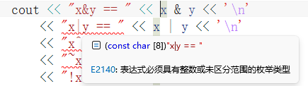
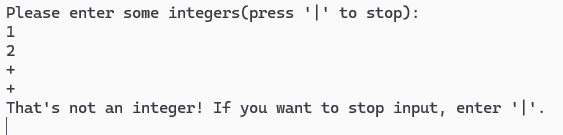
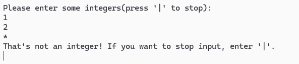
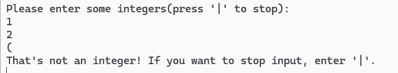
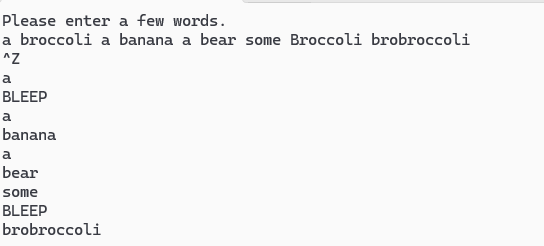
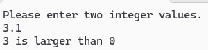

# C++ Notes

## 26/04/23

### double转换为int

    Vector<Point> get_superellipse_points(const int& a, const int& b, const int& m, const int& n, const int& N)
    // The superellipse formula: |x/a|^m + |y/b|^n = 1; 
    // or: x = |cosθ|^(2/m) * a * sgn(cosθ), y = |sinθ|^(2/n) * b * sgn(cosθ).
    {
        Vector<Point> points;
        const double add_θ = pi * 2 / N;
        double x = 0;
        double y = 0;
        int x_scale = 0;
        int y_scale = 0;
        double cosθ = 0;
        double sinθ = 0;
        for (double θ = 0; θ < pi_2; θ += add_θ)
        {
            cosθ = cos(θ);
            sinθ = sin(θ);
            x = pow(fabs(cosθ), 2 / m) * a * sgn(cosθ);
            y = pow(fabs(sinθ), 2 / n) * b * sgn(sinθ);
            x_scale = narrow_cast<int>(x * scale);
            y_scale = narrow_cast<int>(y * scale);
            points.push_back(Point{ c_x + x_scale, c_y + y_scale });
            x, y, x_scale, y_scale, cosθ, sinθ = 0;                     // 注意这行
        }
        return points;
    }

    void superellipse_lines(const Vector<Point>& points, Lines& lines)
    {
        size_t size = points.size();
        for (size_t i = 0; i < size - 1; ++i)
        {
            lines.add(points[i], points[i + 1]);
        }
    }

    void Ex_12(Simple_window& win)
    {
        //Function sine{ dsin, 0, 10, Point{20, 150}, 10, 50, 50 }; // 范围0到10， 起始点{20,150}, 0到10平均分为10个点，每个点到x轴的横坐标*50，纵坐标*50。
        //win.attach(sine);

        Lines se_1;
        superellipse_lines(get_superellipse_points(200, 100, 0.5, 5, 30), se_1);
        win.attach(se_1);

        win.set_label("Ex_12");
        win.wait_for_button();
    }

superellipse_lines(get_superellipse_points(200, 100, 0.5, 5, 30), se_1);传入了0.5，
而get_superellipse_points()函数里有算式：2/m，0.5被转换为0，2/0导致异常。

### 逗号运算符

    x, y, x_scale, y_scale, cosθ, sinθ = 0;  // 这行只给 sinθ 赋值为 0

验证：

    int main()
    {
        double x = 0;
        double y = 0;
        int x_scale = 0;
        int y_scale = 0;
        for (int i = 0; i < 10; ++i)
        {
            cout << x++ << '\t' << y++ << '\t' << x_scale++ << '\t' << y_scale++ << '\n';
            x, y, x_scale, y_scale = 0;
        }
    }

输出：

    0       0       0       0
    1       1       1       0
    2       2       2       0
    3       3       3       0
    4       4       4       0
    5       5       5       0
    6       6       6       0
    7       7       7       0
    8       8       8       0
    9       9       9       0

确实如此。。。

## 26/04/20

### git的可执行文件

git的可执行文件为安装目录的bin文件夹里的git.exe，而不是安装目录的git-bash.exe(只是一个终端模拟器).

### 使用class里的枚举类enum class

    class Font {
    public:
        enum Font_type {
            helvetica,
            helvetica_bold,
            helvetica_italic,
            helvetica_bold_italic,
            courier,
            courier_bold,
            courier_italic,
            courier_bold_italic,
            times,
            times_bold,
            times_italic,
            times_bold_italic,
            symbol,
            screen,
            screen_bold,
            zapf_dingbats
        };

        Font(Font_type ff) :f(ff) { }

        int as_int() const { return f; }
    private:
        int f;
    };

    使用 Font(Font_type ff) :f(ff) { }这个构造函数，要在参数面前加上作用域——Font::

## 26/04/19

### 函数内不能定义另一个函数

    int main(int /*argc*/, char* /*argv*/[])
    { 
        using namespace Graph_lib;                                        // our graphics facilities are in Graph_lib

        Application app;                                                  // start a Graphics/GUI application

        Point tl{ 900,500 };                                              // to become top left corner of window

        Simple_window win{ tl,600,400,"Canvas" };                         // make a simple window

        // e.g.10_3
        //Polygon poly;                                                   // make a shape (a polygon)
        //poly.add(Point{ 300,200 });                                     // add a point
        //poly.add(Point{ 350,100 });                                     // add another point
        //poly.add(Point{ 400,200 });                                     // add a third point
        //poly.set_color(Color::red);                                     // adjust properties of poly
        //win.attach(poly);                                               // connect poly to the window

        // e.g.10_7
        Axis xa{ Axis::x, Point{20, 300}, 280, 10, "x axis" };            // make an Axis
        // an Axis is a kind of Shape
        // Axis::x means horizontal
        // starting at (20,300)
        // 280 pixels long
        // with 10 "notches"
        // label the axis "x axis"
        win.attach(xa);                                                   // attach xa to the window, win
        win.set_label("X axis");                                          // re-label the window
        win.wait_for_button();                                            // display!

        Axis ya{ Axis::y, Point{20,300}, 280, 10, "y axis" };
        ya.set_color(Color::cyan);                                        // choose a color for the y axis
        ya.label.set_color(Color::dark_red);                              // choose a color for the text
        win.attach(ya);
        win.set_label("Y axis");
        win.wait_for_button();                                            // display!

        double dsin(double d）
        {
            return sin(d); 
        }                          // chose the right sin() (§13.3)

        Function sine{ dsin, 0, 100, Point{20,150}, 1000, 50, 50 };       // sine curve
        // plot sin() in the range [0:100) with (0,0) at (20,150)
        // using 1000 points; scale x values *50, scale y values *50

        win.attach(sine);
        win.set_label("Sine");
        win.wait_for_button();
    }

dsin()的第一个大括号报错。
在其他文件直接定义函数习惯了，没注意这个函数定义在main函数里。

## 26/04/16

### 零填充命名

在visual studio中添加名字为10的项目时，发现它排在项目1后面，排在项目2 ~ 项目9前面。
ds：“Visual Studio 解决方案中的项目是按字符串逐字符进行排序”。
要按数字顺序排列，得在项目1~9的名字前面加上0，命名为01~09。

## 26/04/15

### 模块文件的后缀

exercise_02.cpp

    export module exercise_02;

    import PPP;
    using namespace std;

    namespace ex_02
    {
        export void test()
        {
            std::cout << "OK" << '\n';
            PPP::error("okok");
        }
    }

8.exercises.ixx

    export module exercises;

    export import exercise_02;

main.cpp

    import exercises;
    import std;

    int main()
    {
        try
        {
            ex_02::test();

            return 0;
        }
        catch (std::exception& e)
        {
            std::cerr << "error: " << e.what() << '\n';
            return 1;
        }
        catch (...)
        {
            std::cerr << "Oops: unknown exception!" << '\n';
            return 2;
        }
    }

程序正常运行，但是编译器语法检查报错。
在debug文件里，确实也找不到模块对应的.dt文件，但是能找到.ifc文件(C++模块的接口文件)。

将exercise_02.cpp的文件后缀改为.ixx，语法检查不报错了，文件夹里也出现了对应模块的.dt文件

把文件后缀再改回.cpp，语法检查又报了相同的错误，但是Debug文件夹里的.dt文件文件还在。
重新生成后，8.exercises.ixx对应的.dt文件不见了，exercise_02.cpp对应的.dt文件还在，不过是之前生成的。

ds:.cpp 文件 → 传统编译模式 → export module 语法不被识别 → 编译报错

查看Microsoft文档：[https://learn.microsoft.com/en-us/cpp/cpp/import-export-module?view=msvc-170](https://learn.microsoft.com/en-us/cpp/cpp/import-export-module?view=msvc-170)
“Place a module declaration at the beginning of a module implementation file to specify that the file contents belong to the named module.”

    module ModuleA;

在文件开头使用module而不加export，只是表明这个文件的内容属于同名的模块。

添加hello.cpp和hello2.cpp测试：
hello.cpp:

    module exercise_02;

    import std;

    void test_02()
    {
        std::cout << "Hello~" << '\n';
    }

hello2.cpp:

    module exercise_02;

    import std;

    void test_03()
    {
        std::cout << "Hello hello." << '\n';
    }

修改exercise_02.ixx

    export module exercise_02;

    import PPP;
    using namespace std;

    export void test_02();      //在接口文件内导出test_02().
    export void test_03();      //在接口文件内导出test_03().

    namespace ex_02
    {
        export void test()
        {
            std::cout << "OK" << '\n';
            PPP::error("okok");
        }
    }

输出：
Hello~
Hello hello.
OK
error: okok

hello.cpp和hello2.cpp函数的正常运行，验证了：只使用module，只是表明这个文件的内容属于同名的模块。

“**The export module keywords in the first line declare that this file is a module interface unit.** There's a subtle point here: **for every named module, there must be exactly one module interface unit** with no module partition specified. That module unit is called the primary module interface unit.”

“Module unit implementation files don't end with an .ixx extension--they're normal .cpp files.”

“**It(the exported module interface unit) has an .ixx extension by default.** However, you can treat a source file with any extension as a module interface file. To do so, set the Compile As property in the Advanced tab for the source file's properties page to Compile As Module (/interface):”

现在把exercise_02.ixx的后缀改为.cpp，显然编译器语法检查会提示错误。
按照上面的提示操作：

改完后，语法检查不报错了。

总结：
不想单独写模块实现对应的接口文件的话，要把实现文件的后缀改为.ixx。
或者在文件属性页面修改它的编译选项。

## 26/04/12

### 文件复制

在Windows桌面复制文件到Visual Studio的解决方案的项目文件里，然后尝试使用ifstream打开。

    string iname;
    //cin >> iname;
    iname = "temperature_readings.txt";
    ifstream ist{ iname };                          // ist reads from the file named iname
    if (!ist)
        PPP::error("can't open input file ", iname);

打开文件失败。
在文件资源管理器中打开temperature_readings.txt，发现打开的是桌面，说明文件没有被复制到项目的同一目录下。
“Visual Studio 只是创建了一个文件引用（链接），并没有真正把文件复制到项目文件夹中。文件物理位置仍然在桌面。”

## 26/04/10

### 运算符重载：[]只能是成员函数

    enum class Month2
    {
        jan = 1, feb, mar, apr, may, jun, jul, aug, sep, oct, nov, dec
    };

    Month2 operator
    {
        return Month2{ m };
    }

想通过重载[]运算符实现通过Month[5]直接返回may的功能，类似使用数组下标。
但[]只能是成员函数，不能作为全局函数重载。

得这样实现：

    struct Month3
    {
        Month2 operator
        {
            return Month2{ m };
        }
    };
    Month3 month;
    Month2 m3 = month[5];
    Month2 m4 = month[0];
    cout << m3 << '\n';
    cout << m4 << '\n';

全部代码：

    enum class Month2
    {
        jan = 1, feb, mar, apr, may, jun, jul, aug, sep, oct, nov, dec
    };

    struct Month3
    {
        Month2 operator
        {
            return Month2{ m };
        }
    };

    int to_int(Month2 m)
    {
        return static_cast<int>(m);
    }

    vector<string> month_tbl
    {
        "Not a month", "January", "February", "March", "April", "May", "June",
        "July", "August", "September", "October", "November", "December"
    };

    ostream& operator<<(ostream& os, Month2 m)
    {
        return os << month_tbl[to_int(m)];
    }

    int main()
    {
        Month3 month;
        Month2 m3 = month[5];
        Month2 m4 = month[0];
        cout << m3 << '\n';
        cout << m4 << '\n';
    }

输出结果：
May
Not a month

### enum class 和 enum

    enum Month
    {
        jan = 1, feb, mar, apr, may, jun, jul, aug, sep, oct, nov, dec
    };

    enum Day_of_Wekk
    {
        Monday = 1, Tuesday, Wednesday, Thursday, Friday, Saturday, Sunday
    };  

    void bad_code(Month m)
    {
        if (m == 17)
            cout << "do_something" << '\n';
        if (m == Monday)
            cout << "do_something_else" << '\n';
    }

使用bad_code(jan);
控制台会输出：“do_something”.
"In addition to the enum classes, also known as scoped enumerations, there are “plain” enumerations that differ from scoped enumerations by implicitly “exporting” their enumerators to the scope of the enumeration and allowing implicit conversions to int."

推荐使用：

    enum class Month
    {
        jan = 1, feb, mar, apr, may, jun, jul, aug, sep, oct, nov, dec
    };

"The class in enum class means that the enumerators are in the scope of the enumeration. That is, to refer to jan, we have to say Month::jan."

另外，虽然没有定义其他月份的值，但是
"If you leave it to the compiler to pick, it’ll give each enumerator the value of the previous enumerator plus one."

可以把枚举类型认为是和int、double一样，但类型不同的数字。
"Note the use of the qualification of the enumerator mar with the enumeration name: Month::mar. We don’t say Month.mar because Month isn’t an object (it’s a type) and mar isn’t a data member (it’s an enumerator – a symbolic constant)."

## 26/04/07

### const对象只能调用const成员函数

struct Date
{
    int year() { return y; }
    int month() { return m; }
    int day() { return d; }
private:
    int y;
    int m;
    int d;
}

ostream& operator<<(ostream& os, const Date& d)
{
        return os << d.year() << '/' << d.month() << '/' << d.day();
}
给形参Date d加上const和引用类型后，
编译器提示：对象含有与成员函数不兼容的类型限定符。
这是因为编译器无法确定.year(),.month(),.day()是否会修改对象，拒绝调用。
应使这三个函数为const成员函数。

    int year() const { return year_; }   // 加上 const
    int month() const { return month_; } // 加上 const
    int day() const { return day_; }     // 加上 const

## 26/04/05

### vector是动态数组

    constexpr vector<string> reverse_vector_1(const vector<string>& v)

vecotr在堆上分配内存，而编译器没有堆内存。
所以这句的constexpr没有起到作用，跟没有一样。
“A constexpr function behaves just like an ordinary function until you use it where a constant is needed. Then, it is calculated at compile time and its arguments must be constant expressions and gives an error if they are not ”

## 26/04/04

### cout的精度

cout 默认输出浮点数时，只会显示 6 位有效数字

    vector<double> v{ 1.0, 0.99999, 1.000001, 0.5, 1.05 - 1, };
    double max = maxv(v);
    cout << "The max num of the vector is " << max << '\n';

输出了1，而不是1.000001。
因为1.000001有7位有效数字。

使用cout.precision(10);显示更多有效数字。

## 26/04/03

### vector初始化

    vector<string> name(5);

(5)没有限定name的大小为5，只是初始化大小为5的数组，用空字符串填充了这5个位置。

    name.push_back("Guess where I am?");

新插入的s的下标是5，而不是0。

### 比较时，有符号整数被隐式转换为无符号整数

    //输入字符串转换为正整数和0
    int string_to_positive_integer(string s)
    {
        if (is_integer(s))
        {
            int num = 0;
            int digit = 1;
            size_t size = s.size();
            int add = -1;
            for (size_t i = size - 1; i > -1; --i)
            {
                add = (s[i] - '0') * digit;
                //边界检查
                if (num > numeric_limits<int>::max() - add)
                    return -1;
                num += add;
                digit *= 10;
            }
            return num;
        }
        else
            return -1;
    }

for循环永远不会执行。
因为i是无符号类型size_t，-1和i比较时，被转换为4294967295。

## 26/04/02

### 编译器语法检查

有时程序能运行，但编译器提示错误。

这时可以刷新一下visual studio的语法检查，InteliSense

刷新后

### 模块中导出命名空间

drill_2.ixx

    export module drill_2;

    import std;

    namespace X
    {
        int var;
        void print()
        {
            std::cout << "var == " << var << '\n';
        }
    }

main.cpp

    import PPP;
    import drill_2;

    int main()
    {
        X::var = 1;         //编译器提示：命名空间“X”没有成员“var”。
    }

这是因为drill_2.ixx中定义了命名空间X，但没有导出。

而stroustrup提供的PPP.ixx模块：

    export module PPP;      
    export import std;      
    #define PPP_EXPORT export       //将 PPP_EXPORT 定义为 export 关键字

    namespace PPP
    {
        ...

        PPP_EXPORT inline void error(const std::string& s)      // error() simply disguises throws
        {
            throw std::runtime_error(s);
        }

        ...
    }

模块中将PPP_EXPORT 定义为 export 关键字，使用PPP_EXPORT导出命名空间中定义的函数。
我没有发现函数被导出了。

## 26/03/31

### cin.putbacK()

    char ch;        
    cin.get(ch);    //cin.putback()只能在已经读取过的位置放回字符，不能向空输入流中任意插入字符。
    string s;
    cin >> s;       //读取123
    cin.putback('0');
    cin >> s;       //读取0
    cout << s << '\n';
    cin >> s;       //读取456
    cout << s;

输入：
a 123 456
输出：
0
456

这是因为cin.putback()会把字符插入缓冲区的开头，而不是末尾。
读取完123后，缓冲区为" 456"。
cin.putback('0')插入后，缓冲区为"0 456"。

在修PPP第6章的计算器的bug时发现了这个特性。
    void Token_stream::ignore(char c)
    {
        if (full && c == buffer.kind)
        {
            full = false;
            return;
        }
        full = false;

        char ch;
        while (cin.get(ch))
            if (ch == c)
                return;
    }
有一种情况使得进入这个函数时缓冲区为空，使得程序在这里需要用户输入。
就想着用cin.putback(c)在缓冲区末尾加上结束符，解决需要输入的问题，cin.putback()只能插入到开头。

## 26/03/30

### static静态局部变量和函数返回引用类型

    const Date& today()
    {
            static const Date today = get_date_from_clock();             // initialize today the first time we get here
            return today;
    }

static声明的局部变量在第一次初始化后，生命周期和全局变量相同。
在第一次使用today()以后，today = get_date_from_clock()，都只是修改了局部变量today的值，而没有创建新的变量。

## 26/03/29

### cin输出浮点数的有效位数

    double x = 3.14'1523123'2313'123'111;
    cout << x;

输出：3.14152
因为cin默认输出浮点数的6位有效数字

    double y = 12345678.9;
    cout << y;

控制台会输出：1.23457e+07

使用setprecision()输出更多有效数字

    double x = 3.14'1523123'2313'123'111;       //(')是位分隔符，帮助阅读
    cout << setprecision(15) << x;

输出：3.14152312323131

## 26/03/25

### 引用类型和const

如果只是读取数据，可以在引用类型前加上const，防止参数被意外修改。

    void print(const vector<double>& v)                   // pass-by-const-reference
    {
            cout << "{ ";
            for (int i = 0; i<v.size(); ++i) {
                    cout << v[i];
                    if (i!=v.size()−1)
                            cout << ", ";
            }
            cout << " }\n";
    }

### 函数声明和定义

函数声明可以不用带参数

    int my_find(vector<string>, string, int);                    // not naming arguments

    void e7_4()
    {
        vector<string> vs;
        string s;
        cout << my_find(vs, s, 3) << '\n';
    }

    int my_find(vector<string> vs, string s, int hint)
    // search for s in vs starting at hint
    {
        if (hint < 0 || vs.size() <= hint)
            hint = 0;
        for (int i = hint; i < vs.size(); ++i)        // search starting from hint
            if (vs[i] == s)
                return i;
        for (int i = 0; i < hint; ++i)                    // if we didn’t find s, so search before hint
            if (vs[i] == s)
                return i;
        return -1;
    }

如果不再需要用第三个参数，可以不命名。

    int my_find(vector<string> vs, string s, int)
    {
        for (int i = 0; i<vs.size(); ++i)
        if (vs[i]==s) 
            return i;
        return −1;
    }

## 26/03/24

### cin.get()

cin.get()可以读取输入流中的空格和换行符

    while (cin)
    {
        char ch = cin.get();    //也可以char ch; cin.get(ch);
        if (ch == '\n')
            cout << "find a \\n.";
        if (ch == ' ')
            cout << "find a whitespace.";
        if (isspace(ch))
            cout << " That's a space." << '\n';
    }

输入：
123 456 abc dsds
输出：
find a whitespace. That's a space.
find a whitespace. That's a space.
find a whitespace. That's a space.
find a \n. That's a space.

## 26/03/22

### 标准库函数isaplha()

        isalpha('）');

函数参数的值超出了有效范围[-1，255]。
 '）' 是宽字符，Unicode码点是65289。

## 26/03/19

### 函数参数引用传递

    void deal_with_plus_sign(string &s)
    {
        if (s[0] == '+')
            s.erase(0, 1);
    }

    bool is_integer(string s)
    {
        deal_with_plus_sign(s);
        for (char x : s)
        {
            if (x < '0' || x > '9')
                return false;
        }
        return true;
    }

    int string_to_positive_integer(string s)
    {
        if (is_integer(s))
        {
            int num = 0;
            int digit = 1;
            int size = s.size();
            int add = -1;
            for (int i = size - 1; i > -1; --i)
            {
                add = (s[i] - '0') * digit;
                //边界检查
                if (num > numeric_limits<int>::max() - add)
                    return -1;
                num += add;
                digit *= 10;
            }
            return num;
        }
        else
            return -1;
    }

deal_with_plus_sign(string &s)是新加的用于处理正号的函数。
只在这个函数里使用引用类型，程序仍不能正常运行。
因为它只修改了is_integer() 从 string_to_positive_integer()获取的字符串s的副本，
没有改变string_to_positive_integer()使用的字符串s。

需要在is_integer()内也使用引用类型。is_integer(string &s)

## 26/03/17

### ixx文件的函数声明没有加参数

连接错误，编译器找不到无参数的test1()函数实现。

## 26/03/16

### int类型 与 阶乘

        int fac = 1;
        for (int i = 1; i < 20; ++i)
        {
            for (int j = i; j > 0; --j)
            {
                fac *= j;
            }
            cout << "fac(" << i << ") == " << fac << '\n';
            fac = 1;
        }

输出：
fac(1) == 1
fac(2) == 2
fac(3) == 6
fac(4) == 24
fac(5) == 120
fac(6) == 720
fac(7) == 5040
fac(8) == 40320
fac(9) == 362880
fac(10) == 3628800
fac(11) == 39916800
fac(12) == 479001600
fac(13) == 1932053504
fac(14) == 1278945280
fac(15) == 2004310016
fac(16) == 2004189184
fac(17) == -288522240
fac(18) == -898433024
fac(19) == 109641728

因为
12! == 479001600;
13! == 6227020800 > 2147483647 (图中显示1932053504是因为只保留了32位的值，超出部分被截断)
所以int类型最多只能存12!。

检查溢出的方法：

加法：if(num > numeric_limits\<int>::max() - addendd)

乘法：if(num > numeric_limits\<int>::max() / multiplier)

如果是计算排列和组合，可以用for循环。

### cin输入CTRL+Z

    string s;
    while (true)
    {
        std::cin >> s;
        
        //省略中间代码...

        s.clear();
    }

string 能存储所有字符，所以cin很难进入错误状态。
但如果单独输入CTRL+Z，会使cin进入错误状态。
可以在上面的循环末尾加上cin.clear();重置cin的状态。

另外，CTRL+Z 只有在单独一行时才会被识别为 EOF。如果它出现在其他字符之后，则会被视为普通字符。

    string s;
    int count = 0;
    while (count < 10)
    {
        cin >> s;
        ++count;
    }
    cout << "end successfully";

输入：
CTRL+Z 0909s
输出：
end successfully

而输入：
0909s CTRL+Z
控制台显示：

仍需要输入，说明cin没有进入错误状态，这又说明CTRL+Z没有被识别为EOF。

## 26/03/15

### <<和&&的优先级

    int num1 = 0b1010;      //10
    int num2 = 0b1001;      //9
    cout << num1 && num2;

输出了10，因为“<<”的优先级比“&&”高，所以输出的实际上是0b1010的十进制值，然后计算(cout)&&(0b1001)得到true。

查看(cout)&&(0b1001)的结果：

    cout << (cout << num1 && num2);

输出：
101

与运算的运算符是“&”，而不是“&&”。

    cout << (num1 & num2);
    cout << bitset<4>(num1 & num2);

输出：
8
1000

直接比较优先级：
    int x = 10;
    int y = 10;
    cout << "x&y == " << x & y << '\n'
        << "x|y == " << x | y << '\n'
        << "x^y == " << x ^ y << '\n'
        << "~x == " << ~x << '\n'
        << "!x == " << !x << '\n';

编译器提示表达式具有未区分范围的枚举类型，也是因为运算符“<<”优先级比位运算符(&, |, ^, ~, !)高

所以，直接使用cout输出位运算的表达式时，应该给表达式加上括号cout << (x & y)。

### 异常处理

    try
    {
        int num;
        cin >> num;
        switch (num)
        {
        case 0:
            throw runtime_error("It's '0'.");
            cout << " Why not?" << '\n';
            break;
        }
    }
    catch (exception& e)
    {
        cerr << "Exception: " << e.what() << '\n';
    }

输入：
0
输出：
0
Exception: It's '0'.        //没有输出" Why not?"

在case 0:分支的error()函数抛出异常后，程序的控制权就会立即转移给异常处理机制，当前作用域内剩余的正常执行流程都会被中断。所以cout << " Why not?" << '\n';没有被执行。

### 输入数据超出int范围使cin进入错误状态

    void input_pairs(vector<Name_value> Nvs)
    {
        bool duplicate_name = false;
        string name = " ";
        int grade = -1;
        while (true)
        {
            duplicate_name = false;
            cin >> name >> grade;

            //结束输入
            if (name == "NoName" && grade == 0)
                break;
            
            //检查输入名字是否已存在
            for (Name_value x : Nvs)
            {
                if (name == x.name)
                {
                    duplicate_name = true;
                    break;
                }
            }
            if (duplicate_name)
            {
                cout << "It's a duplicate name, you have entered it before." << '\n';
            }
            else
            {
                Name_value nv(name, grade);
                Nvs.push_back(nv);
            }
        }
    }

输入（5，55555555555555555555555），程序会进入死循环，持续输出“It's a duplicate name, you have entered it before.”

因为55555555555555555555555超出了int的最大范围2147483647，使cin进入错误状态。
在第二次及以后的循环，name和grade的值始终为第一次输入的值。

可以输入字符，然后转换为数字，因为输入字符基本不会使cin出错；
或者每次循环结束时重置cin的状态。

## 26/03/11

### cin.putback()

        char i = '/';
        cin >> i;
        cin.putback(i);
        int c = 0;
        cin >> c;
        cout << "c == " << c;

输入565623，控制台打印565623，觉得奇怪，因为char只能存-128到127。

实际流程为：输入565623，i只读取了一个字符‘5’，而没有读取全部的565623，读取后缓冲区还剩下65623。
cin.putback(i)把‘5’放回缓冲区后，cin又把565623全部读入c。

注释掉cin.putback(i);后，再次输入565623。
可以看到控制台打印的是65623

## 26/03/09

### 异常输出多字符字面量

    void exercise12()
    {
        vector<int> target;
        int seconds = time(0);
        default_random_engine engine(seconds);
        uniform_int_distribution<int> dist(0, 9);
        for (int i = 0; i < 4; ++i)
            target.push_back(dist(engine));
        
        cout << "target.size() == " << target.size() << '\n';
        cout << "The answer is: ";
        for (int i = 0; i < target.size(); ++i)
            cout << target[i];
        cout << ' !' << '\n';
    }

这个生成随机数函数会输出8位数，但后四位始终输出8225。
起初以为是越界访问了，但target.size()大小正确。
调试发现，cout << ' !' << '\n';，这一行输出了4个数，而' !'为“空格+！”，是多字符字面量。
多字符字面量将字符组合成一个一个整数，输出它的数值表示，而不是字符。

    cout << ' !' << '\n';

输出：8225

### cin的状态

    int input = -1;
    int count = 0;
    string s = "^_^";
    bool incorrect = true;
    while (incorrect)
    {
        cin >> input;
        cin >> s;
        if(s != "^_^")
            cout << "Invalid input, you should enter a 4-digit integer." << '\n';
        else
        {
            if ((input < 1000) || (input > 9999))
                cout << "Invalid input. A 4-digit number is required." << '\n';
            cout << "Input == " << input << '\n';
        }
        s = "^_^";
        ++count;
    }

第一次输入“\*”，会使cin进入错误状态，会跳过第二次输入，导致缓冲区的“\*”不会被消费，程序进入死循环。

    int x;
    string s;

    cin >> x;
    //cin.clear();
    cin >> s;

    cout << "x == " << x << '\n'
        << "s == " << s << '\n';

输入：*
输出：
x == 0
s ==

使用cin.clear()重新设置cin为默认的正确状态。

## 26/03/08

### cout的状态

    if (cout)
        cout << "Success!\n";
    else cout << "Fail\n";

if检查cout的状态，cout的默认状态为真，所以会输出“Success!”。

    if(cout << "Success1!\n" << "Success2!\n" << "Success3!\n");

输出：
Success1!
Success2!
Success3!

输出3次，设置3次cout的状态。

### cin的特殊处理

    cout << "Please enter some integers(press '|' to stop): " << '\n';
    vector<int> v;
    char c = ' ';
    int n;
    while (c != '|')
    {
        if(cin >> n)
            v.push_back(n);
        else
        {
            cin.clear();
            if (c != '|')
                cout << "That's not an integer! If you want to stop input, enter '|'." << '\n';
        }
    }

输入‘+’，else分支会执行一次然后进入下一个循环，而输入‘*’或‘=’，程序会进入死循环。
这里先不关注输入‘*’或‘=’，把目光放在输入‘+’上。
cin 对 ‘+’ 和 ‘-’ 进行特殊处理。‘+’被视为正号；‘-’被视为负号。

    int num;
    cin >> num;
    cout << num;

输入：+7
输出：7

输入：-7
输出：-7

另外，如果输入错误，会把变量赋值为0，同时把cin进入错误状态。

    int num;
    if (cin >> num)
    {
        cout << num << '\n';
    }
    cout << num;

输入：+
输出：0

输入：+0
输出：
0
0

另外的另外，

    void exercise8()
    {
        cout << "Please enter some integers(press '|' to stop): " << '\n';
        vector<int> v;
        char c = ' ';
        int n;

        while (c != '|')
        {
            if(cin >> n)
                v.push_back(n);
            else
            {
                cin.clear();
                cin >> c;
                if (c != '|')
                    cout << "That's not an integer! If you want to stop input, enter '|'." << '\n';
            }
        }
    }

输入：

这说明，虽然‘+’和其他字符虽然同为字符，cin在碰到时它们时会把变量值设置为0，且进入错误状态，但cin会消费掉缓冲区的‘+’，但不会消费掉缓冲区的其他字符。

## 26/03/06

main.cpp

    import drill;

    int main()
    {
        try
        {
            throw runtime_error(">?");
            return 0;
        }
        catch (exception& e)
        {
            cerr << "error: " << e.what() << '\n';
            return 1;
        }
        catch (...)
        {
            cerr << "Oops: unknown exception!" << '\n';
            return 2;
        }
    }

4.drill.ixx

    export module drill;

    import std;

    using namespace std;

    export void drill_1();

运行main.cpp，会提示标准库函数未定义，因为using namespace std;的作用域仅限于当前文件->4.drill.ixx。
而main.cpp里没有这个定义。

4.drill.cpp

    module drill;
    void drill_1()
    {
        try
        {
            throw runtime_error(">?");
        }
        catch (exception& e)
        {
            cerr << "error: " << e.what() << '\n';
        }
        catch (...)
        {
            cerr << "Oops: unknown exception!" << '\n';
        }
    }

修改后的main.cpp

import drill;

    int main()
    {
        drill_1();
        return 0;
    }

使用main.cpp调用drill_1()函数，程序正常执行，没有未定义错误。
这是因为main函数只是启动执行drill_1()函数和获取它的结果，该函数没有在main.cpp里执行。
而drill_1()是在4.drill.ixx和4.drill.cpp共同组成的drill模块中执行的，模块导入了std标准库且声明了使用std::命名空间。

## 26/02/16

### cin被隐式转换为bool类型

    vector<double> temps;
    for (double temp; cin >> temp;)
        temps.push_back(temp);

    double sum = 0;
    for (double x : temps)      //  ==     for (int i = 0; i < temps.size(); i++)   double x = temps[i];
        sum += x;
    cout << "Average temperatrue: " << sum / temps.size() << '\n';
    return 0;

Basically, cin>>temp is true if a value was read correctly and false otherwise,
so that for-statement will read all the doubles we give it and stop when we give it anything else.
For example, if you typed    1.2 3.4 5.6 7.8 9.0 |
then temps would get the five elements 1.2, 3.4, 5.6, 7.8, 9.0 (in that order, for example, temps[0]==1.2).
We used the character '|' to terminate the input – anything that isn’t a double can be used.

### string是字符容器，而不是一个简单的整体

    cout << "Please enter a string" << endl;
    string s;
    cin >> s;
    for (char c : s)
        cout << c << '\t' << int(c) << endl;
    
输入：string
输出：
s       115
t       116
r       114
i       105
n       110
g       103

for (char c : s) cout << c << '\t' << int(c) << endl;
能遍历输出字符串s的每个字符，因为std::string提供了迭代器接口。。。

### 副本与使用引用

    //替换敏感词为“BLEEP”
    vector<string> words;
    cout << "Please enter a few words." << endl;

    for (string word; cin >> word;)
        words.push_back(word);

    for (string word : words)
        if (word == "Broccoli" || word == "broccoli")
            word = "BLEEP";

    for (string word : words)
        cout << word << endl;

西兰花不会被成功替换，因为第二个for循环的word是数组元素的副本，修改时不会修改原数组。

输入：a broccoli a banana a bear some Broccoli brobroccoli
再输入：CTRL+Z
输出：
a
broccoli
a
banana
a
bear
some
Broccoli
brobroccoli

应该使用引用类型，for (string &word : words)
修改后：
使用同样的输入
输出：
a
BLEEP
a
banana
a
bear
some
BLEEP
brobroccoli

broccoli成功被替换为BLEEP

## 26/02/14

    cout << "Please enter yen('y'), kroner('k'), or pounds('p') and I'll convert it into dollars." << endl;
    double value;
    char unit = ' ';
    cin >> value >> unit;
    switch (unit)
    {
    case 'y':
        cout << value << unit << " is " << value * 0.0065 << " dollars";
        break;
    case 'k':
        cout << value << unit << " is " << value * 0.1589 << " dollars";
        break;
    case 'p':
        cout << value << unit << " is " << value * 1.3647 << " dollars";
        break;
    default:
        cout << "Sorry I don't know a unit called " << unit;
    }
    cout << endl;

输入1yuan,会输出“1y is 0.0065 dollars”，而非 “Sorry I don't know a unit called yuan”。
因为cin在从缓冲区读取时，只会读取yuan的第一个字符y，使得程序执行'y'分支。

## 26/02/13

### 1.cin输入时类型不匹配导致输入失败

    cout << "Please enter two integer values." << endl;
    int val1, val2;
    cin >> val1 >> val2;
    if (val1 < val2)
        cout << val1 << " is smaller than " << val2;
    else if (val1 > val2)
        cout << val1 << " is larger than " << val2;
    else
        cout << val1 << " equals " << val2;
    cout << endl;
    int sum = val1 + val2;
    int difference = val1 - val2;
    int product = val1 * val2;
    int ratio = val1 / val2;

    cout << val1 << " + " << val2 << " == " << sum << endl
        << val1 << " - " << val2 << " == " << difference << endl
        << val1 << " * " << val2 << " == " << product << endl
        << val1 << " / " << val2 << " == " << ratio << endl;

输入3.1，按下回车，不等输入第二个值，程序直接显示输入结果。

cin>>val1时：cin从缓冲区读取3后读取到小数点，停止读取，3存入val1。
cin>>val2时：缓冲区还剩下.1,cin读取到小数点，读取失败，val2仍是未初始化的状态。

## 26/01/31

### cin的特性

1.如果一直没有遇到非空白字符，则会持续等待真正的输入（忽略这次输入）

2.如果检查到非空白字符，则在下一次遇到空白字符时，会使用空白字符以前的字符串，将空白字符以后的字符串存入缓冲区。

    string previous;
    string current;
    cin >> previous >> current;
    cout << "previous == " << previous << ", current == " << current << " \n";

输入：
    1.Charles Dickens
    2.Mr. Charles Dickens

输出：
    1.
    previous == Charles, current == Dickens
    2.
    previous == Mr., current == Charles

        string previous;
        string current;
        while (cin >> current)
        {
            if (previous == current)
                cout << current: <<
                cout << "repeated word: " << current << "\n";
            previous = current;
        }

输入：
    1.The cat cat jumped
    2.She she laughed "he he he!" because what he did did not look very very good good
输出：
    1.repeated word: cat
    2.
    repeated word: did
    repeated word: very
    repeated word: good
