# C++ Notes

## 26/03/16

### int类型 与 阶乘

    int main()
    {
        int fac = 1;
        for (int i = 1; i < 20; ++i)
        {
            for (int j = i; j > 0; --j)
            {
                fac *= j;
            }
            cout << "fac(" << i << ") == " << fac << '\n';
            fac = 1;
        }
    }

12! == 479001600;
13! == 6227020800 > 2147483647 (图中显示1932053504是因为只保留了32位的值，超出部分被截断)
所以int类型最多只能存12!。

检查溢出的方法：

加法：if(num > numeric_limits\<int>::max() - addendd)

乘法：if(num > numeric_limits\<int>::max() / multiplier)

如果是计算排列和组合，可以用for循环。

### cin输入ctrl+z

    string s;
    while (true)
    {
        std::cin >> s;
        
        //省略中间代码...

        s.clear();
    }

string 能存储所有字符，所以cin很难进入错误状态。
但如果单独输入ctrl+z，会使cin进入错误状态。
可以在上面的循环末尾加上cin.clear();重置cin的状态。

另外，ctrl+Z 只有在单独一行时才会被识别为 EOF。如果它出现在其他字符之后，则会被视为普通字符。

    int main()
    {
        string s;
        int count = 0;
        while (count < 10)
        {
            cin >> s;
            ++count;
        }
        cout << "end successfully";
    }

## 26/03/15

### <<和&&的优先级

    int main()
    {
        int num1 = 0b1010;
        int num2 = 0b1001;

        cout << (cout << num1 && num2;)
    }

输出了10，因为“<<”的优先级比“&&”高，所以输出的实际上是0b1010的十进制值，然后计算(cout)&&(0b1001)为true;

cout << (cout << num1 && num2); 输出：

正确的写法为
    int num1 = 0b1010;
    int num2 = 0b1001;
    cout << bitset<4>(num1 & num2);

    int main()
    {
        int x = 10;
        int y = 10;
        cout << "x&y == " << x & y << '\n'
            << "x|y == " << x | y << '\n'
            << "x^y == " << x ^ y << '\n'
            << "~x == " << ~x << '\n'
            << "!x == " << !x << '\n';
    }
编译器提示表达式具有未区分范围的枚举类型，也是因为运算符“<<”优先级比“按位运算符”高

### 异常处理

    void error(string s)
    {
        throw runtime_error(s);
    }

    int main()
    {
        try
        {
            int num;
            cin >> num;
            switch (num)
            {
            case 0:
                error("0");
                cout << "and 0" << '\n';
                break;
            }
        }
        catch (exception& e)
        {
            cerr << "Exception: " << e.what() << '\n';
            return 1;
        }
        catch (...)
        {
            cerr << "Unknown exception" << '\n';
            return 2;
        }
    }

在case 0:分支的error()函数抛出异常后，程序的控制权就会立即转移给异常处理机制，当前作用域内剩余的正常执行流程都会被中断。

控制台没有打印“and 0”。

### 输入数据超出int范围使cin进入错误状态

    void input_pairs(vector<Name_value> Nvs)
    {
        bool duplicate_name = false;
        string name = " ";
        int grade = -1;
        while (true)
        {
            duplicate_name = false;
            cin >> name >> grade;

            //结束输入
            if (name == "NoName" && grade == 0)
                break;
            
            //检查输入名字是否已存在
            for (Name_value x : Nvs)
            {
                if (name == x.name)
                {
                    duplicate_name = true;
                    break;
                }
            }
            if (duplicate_name)
            {
                cout << "It's a duplicate name, you have entered it before." << '\n';
            }
            else
            {
                Name_value nv(name, grade);
                Nvs.push_back(nv);
            }
        }
    }

输入（5，55555555555555555555555），程序会进入死循环，持续打印“It's a duplicate name, you have entered it before.”

因为55555555555555555555555超出了int的最大范围2147483647，使cin进入错误状态。
在第二次及以后的循环，name和grade的值始终为第一次输入的值。

可以输入字符，然后转换为数字，因为输入字符基本不会使cin出错；
或者每次循环结束时重置cin的状态。

## 26/03/11

### cin.putback()

    int main()
    {
        char i = '/';
        cin >> i;
        cin.putback(i);
        int c = 0;
        cin >> c;
        cout << "c == " << c;
    }

输入565623，控制台打印565623，觉得奇怪，因为char只能存-128到127。

实际流程为：输入565623，i只读取了一个字符‘5’，缓冲区还剩下65623。
然后cin.putback(i)把‘5’放回缓冲区。
cin又把565623全部读入c。

注释掉cin.putback(i);后可以看到控制台打印的是65623

## 26/03/09

### 异常输出多字符字面量

    void exercise12()
    {
        vector<int> target;
        int seconds = time(0);
        default_random_engine engine(seconds);
        uniform_int_distribution<int> dist(0, 9);
        for (int i = 0; i < 4; ++i)
            target.push_back(dist(engine));
        
        cout << "target.size() == " << target.size() << '\n';
        cout << "The answer is: ";
        for (int i = 0; i < target.size(); ++i)
            cout << target[i];
        cout << ' !' << '\n';
    }

程序会输出8位数，但后四位始终输出8225。
起初以为是越界访问了，但target.size()大小正确。
调试发现，cout << ' !' << '\n';，这一行输出了4个数，而' !'为“空格+！”，是多字符字面量。
多字符字面量将字符组合成一个一个整数，输出它的数值表示，而不是字符。

    int main()
    {
        cout << ' !' << '\n';
    }

### cin的状态

    int input = -1;
    int count = 0;
    string s = "^_^";
    bool incorrect = true;
    while (incorrect)
    {
        cin >> input;
        cin >> s;
        if(s != "^_^")
            cout << "Invalid input, you should enter a 4-digit integer." << '\n';
        else
        {
            if ((input < 1000) || (input > 9999))
                cout << "Invalid input. A 4-digit number is required." << '\n';
            cout << "Input == " << input << '\n';
        }
        s = "^_^";
        ++count;
    }

第一次输入“\*”，会使cin进入错误状态，会跳过第二次输入，导致缓冲区的“\*”不会被消费，程序进入死循环。

    int x;
    string s;

    cin >> x;
    //cin.clear();
    cin >> s;

    cout << "x == " << x << '\n'
        << "s == " << s << '\n';

使用cin.clear()重新设置cin为默认的正确状态。

## 26/03/08

### cout的状态

    if (cout)
        cout << "Success!\n";
    else cout << "Fail\n";

if检查cout的状态，cout的默认状态为真，所以会输出“Success!”。

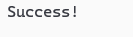

    if(cout << "Success1!\n" << "Success2!\n" << "Success3!\n")

会输出3次，设置3次cout的状态。

### cin的特殊处理

    cout << "Please enter some integers(press '|' to stop): " << '\n';
    vector<int> v;
    char c = ' ';
    int n;

    while (c != '|')
    {
        if(cin >> n)
            v.push_back(n);
        else
        {
            cin.clear();
            if (c != '|')
                cout << "That's not an integer! If you want to stop input, enter '|'." << '\n';
        }
    }

输入‘+’，else分支会执行一次然后进入下一个循环，而输入‘*’或‘=’，程序会进入死循环。
这个程序进入死循环是正常的。
cin 对 ‘+’ 和 ‘-’ 进行特殊处理。‘+’被视为正号；‘-’被视为负号。

    int main()
    {
        int num;
        cin >> num;
        cout << num;
    }

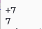
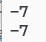

另外，如果输入错误，会把变量赋值为0，同时把cin进入错误状态。

    int main()
    {
        int num;
        if (cin >> num)
        {
            cout << num << '\n';
        }
        cout << num;
    }

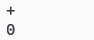
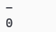
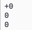
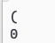
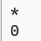

另外的另外，

    void exercise8()
    {
        cout << "Please enter some integers(press '|' to stop): " << '\n';
        vector<int> v;
        char c = ' ';
        int n;

        while (c != '|')
        {
            if(cin >> n)
                v.push_back(n);
            else
            {
                cin.clear();
                cin >> c;
                if (c != '|')
                    cout << "That's not an integer! If you want to stop input, enter '|'." << '\n';
            }
        }
    }

输入：

这说明，虽然‘+’和其他字符虽然同为字符，cin在碰到时它们时会把变量值设置为0，且进入错误状态，但cin会消费掉缓冲区的‘+’，但不会消费掉缓冲区的其他字符。

## 26/03/06

main.cpp

    import drill;

    int main()
    {
        try
        {
            throw runtime_error(">?");
            return 0;
        }
        catch (exception& e)
        {
            cerr << "error: " << e.what() << '\n';
            return 1;
        }
        catch (...)
        {
            cerr << "Oops: unknown exception!" << '\n';
            return 2;
        }
    }

4.drill.ixx

    export module drill;

    import std;

    using namespace std;

    export void drill_1();

运行main.cpp，会提示标准库函数未定义，因为using namespace std;的作用域仅限于当前文件->4.drill.ixx。
而main.cpp里没有这个定义。

4.drill.cpp

module drill;

    void drill_1()
    {
        try
        {
            throw runtime_error(">?");
        }
        catch (exception& e)
        {
            cerr << "error: " << e.what() << '\n';
        }
        catch (...)
        {
            cerr << "Oops: unknown exception!" << '\n';
        }
    }

修改后的main.cpp

import drill;

    int main()
    {
        drill_1();
        return 0;
    }

使用main.cpp调用drill_1()函数，程序正常执行，没有未定义错误。
这是因为main函数只是启动执行drill_1()函数和获取它的结果，该函数没有在main.cpp里执行。
而drill_1()是在4.drill.ixx和4.drill.cpp共同组成的drill模块中执行的，模块导入了std标准库且声明了使用std::命名空间。

## 26/02/16

### cin被隐式转换为bool类型

    int main()
    {
        vector<double> temps;
        for (double temp; cin >> temp;)
            temps.push_back(temp);

        double sum = 0;
        for (double x : temps)      //  ==     for (int i = 0; i < temps.size(); i++)   double x = temps[i];
            sum += x;
        cout << "Average temperatrue: " << sum / temps.size() << '\n';
        return 0;
    }

Basically, cin>>temp is true if a value was read correctly and false otherwise,
so that for-statement will read all the doubles we give it and stop when we give it anything else.
For example, if you typed    1.2 3.4 5.6 7.8 9.0 |
then temps would get the five elements 1.2, 3.4, 5.6, 7.8, 9.0 (in that order, for example, temps[0]==1.2).
We used the character '|' to terminate the input – anything that isn’t a double can be used.

### string是字符容器，而不是一个简单的整体

    import std;

    using namespace std;

    void exercise2()
    {
        cout << "Please enter a string" << endl;
        string s;
        cin >> s;
        for (char c : s)
            cout << c << '\t' << int(c) << endl;
    }
    
for (char c : s) cout << c << '\t' << int(c) << endl;
能遍历输出字符串s的每个字符，因为std::string提供了迭代器接口。。。

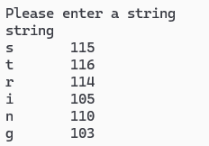

### 副本与使用引用

    import std;

    using namespace std;

    //替换敏感词为“BLEEP”
    int main()
    {
        vector<string> words;
        cout << "Please enter a few words." << endl;

        for (string word; cin >> word;)
            words.push_back(word);

        for (string word : words)
            if (word == "Broccoli" || word == "broccoli")
                word = "BLEEP";

        for (string word : words)
            cout << word << endl;

        return 0;
    }

西兰花不会被成功替换，因为第二个for循环的word是数组元素的副本，修改时不会修改原数组。

更正：使用引用，for (string &word : words)

## 26/02/14

    void e3412()
    {
        cout << "Please enter yen('y'), kroner('k'), or pounds('p') and I'll convert it into dollars." << endl;
        double value;
        char unit = ' ';
        cin >> value >> unit;
        switch (unit)
        {
        case 'y':
            cout << value << unit << " is " << value * 0.0065 << " dollars";
            break;
        case 'k':
            cout << value << unit << " is " << value * 0.1589 << " dollars";
            break;
        case 'p':
            cout << value << unit << " is " << value * 1.3647 << " dollars";
            break;
        default:
            cout << "Sorry I don't know a unit called " << unit;
        }

        cout << endl;
    }

输入1yuan,会输出“1y is 0.0065 dollars”，而非 “Sorry I don't know a unit called yuan”。

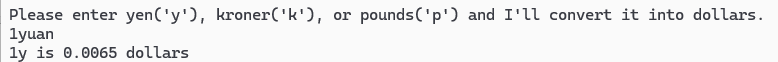

因为cin在从缓冲区读取时，只会读取yuan的第一个字符y，使得程序执行'y'分支。

## 26/02/13

### 1.cin输入时类型不匹配导致输入失败

    void exercise4()
    {
        cout << "Please enter two integer values." << endl;
        int val1, val2;
        cin >> val1 >> val2;
        if (val1 < val2)
            cout << val1 << " is smaller than " << val2;
        else if (val1 > val2)
            cout << val1 << " is larger than " << val2;
        else
            cout << val1 << " equals " << val2;
        cout << endl;
        int sum = val1 + val2;
        int difference = val1 - val2;
        int product = val1 * val2;
        int ratio = val1 / val2;

        cout << val1 << " + " << val2 << " == " << sum << endl
            << val1 << " - " << val2 << " == " << difference << endl
            << val1 << " * " << val2 << " == " << product << endl
            << val1 << " / " << val2 << " == " << ratio << endl;
    }

输入3.1，按下回车，不等输入第二个值，程序直接显示输入结果。

cin>>val1时：cin从缓冲区读取3后读取到小数点，停止读取，3存入val1。
cin>>val2时：缓冲区还剩下.1,cin读取到小数点，读取失败，val2仍是未初始化的状态。

## 26/01/31

### cin的特性

1.如果一直没有遇到非空白字符，则会持续等待真正的输入（忽略这次输入）

2.如果检查到非空白字符，则在下一次遇到空白字符时，会使用空白字符以前的字符串，将空白字符以后的字符串存入缓冲区。

    #include <iostream>

    using namespace std;

    int main()
    {
        string previous;
        string current;
        cin >> previous >> current;
        cout << "previous == " << previous << ", current == " << current << " \n";
        return 0;
    }

输入：
    1.Charles Dickens
    2.Mr. Charles Dickens

输出：
    1.
    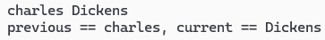
    2.
    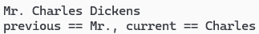

    #include <iostream>

    using namespace std;

    int main()
    {
        string previous;
        string current;
        while (cin >> current)
        {
            if (previous == current)
                cout << current: <<
                cout << "repeated word: " << current << "\n";
            previous = current;
        }
        return 0;
    }

输入：
    1.The cat cat jumped
    2.She she laughed "he he he!" because what he did did not look very very good good
输出：
    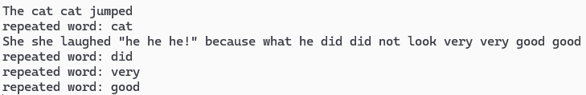
